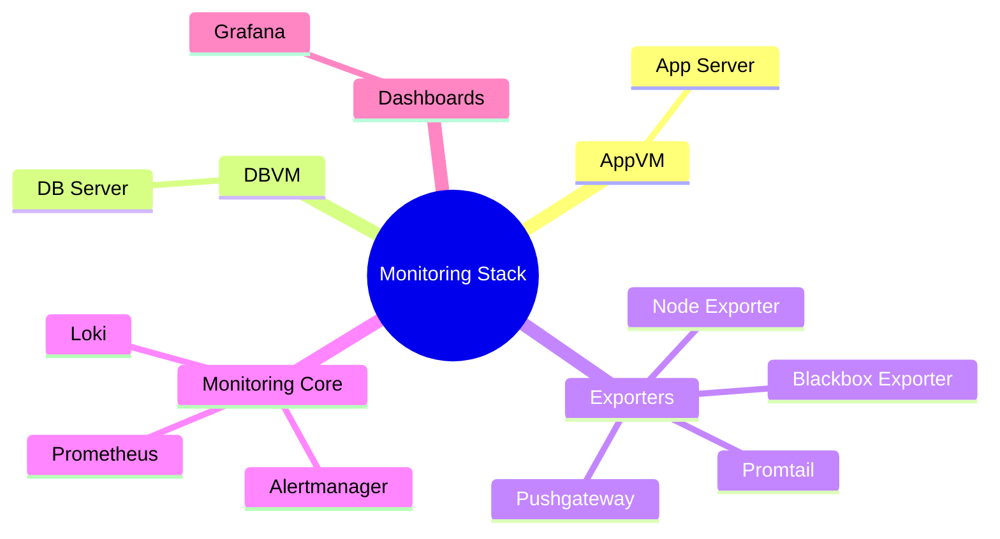
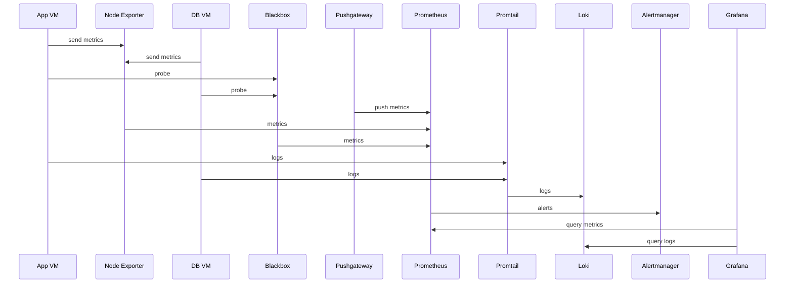

# monitoring_tools

 ```mermaid
graph TD
    %% Users
    User[User]

    %% Workload VMs
    AppVM[App VM - Application server]
    DBVM[DB VM - Database server]

    %% Monitoring Cluster
    MonCluster[Monitoring Cluster: Prometheus, Loki, Alertmanager, Exporters]
    Grafana[Grafana - Dashboard]

    %% Flows
    User --> Grafana
    AppVM --> MonCluster
    DBVM --> MonCluster
    MonCluster --> Grafana

```




